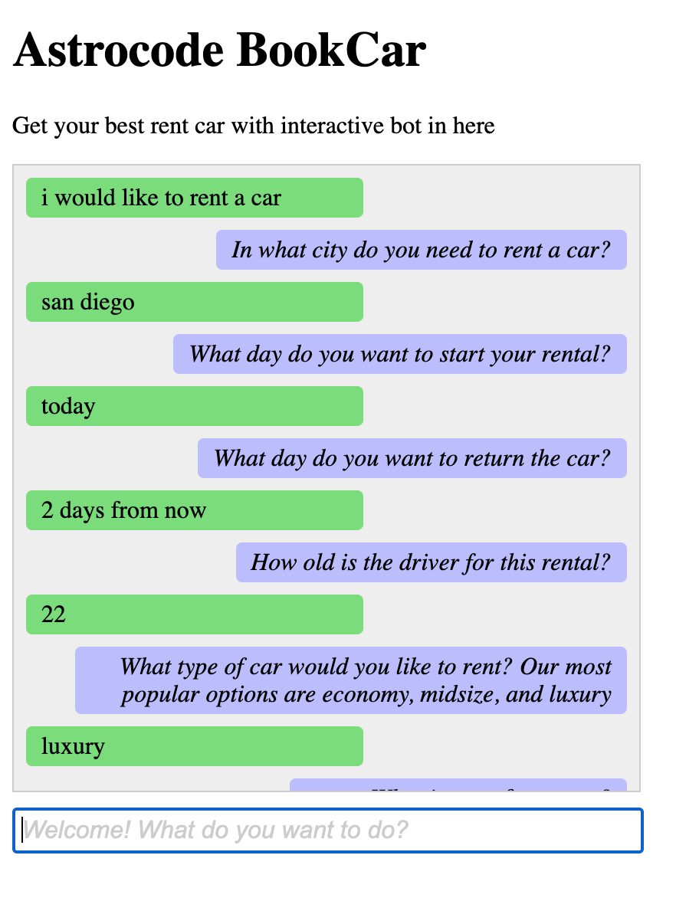
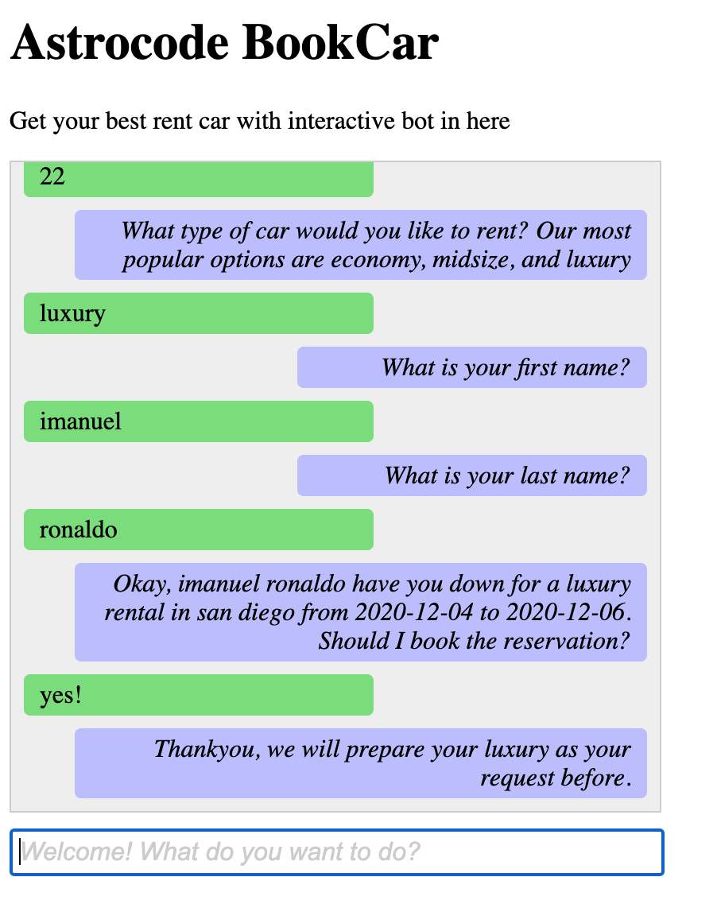

# About Application
This application is using Laravel 7 and create a real time application that connecting to amazon services: Amazon Lex Bot.
# How to use

### Installation

- clone this project to your local computer using `git clone` or download it as zip
- after that, use `composer install` to install the php library
- use `php artisan serve` and access the website at `localhost:8000`

### Example of use
- start your command with available command like:
```sh
- I would like to travel
- Make a car reservation
- Reserve a car
- Book a car
```

- after that, you can start to choose the day that you want to book and another criteria. For further example, you can see at the image below:
  
  

<p align="center"><a href="https://laravel.com" target="_blank"></a></p>

<p align="center">
<a href="https://travis-ci.org/laravel/framework"></a>
<a href="https://packagist.org/packages/laravel/framework"></a>
<a href="https://packagist.org/packages/laravel/framework"></a>
<a href="https://packagist.org/packages/laravel/framework"></a>
</p>

## About Laravel

Laravel is a web application framework with expressive, elegant syntax. We believe development must be an enjoyable and creative experience to be truly fulfilling. Laravel takes the pain out of development by easing common tasks used in many web projects, such as:

- [Simple, fast routing engine](https://laravel.com/docs/routing).
- [Powerful dependency injection container](https://laravel.com/docs/container).
- Multiple back-ends for [session](https://laravel.com/docs/session) and [cache](https://laravel.com/docs/cache) storage.
- Expressive, intuitive [database ORM](https://laravel.com/docs/eloquent).
- Database agnostic [schema migrations](https://laravel.com/docs/migrations).
- [Robust background job processing](https://laravel.com/docs/queues).
- [Real-time event broadcasting](https://laravel.com/docs/broadcasting).

Laravel is accessible, powerful, and provides tools required for large, robust applications.
